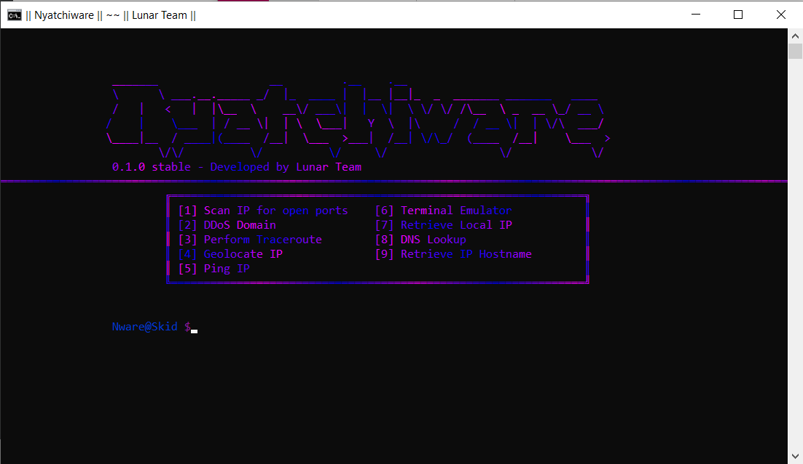

# - Nyatchiware -
Nyatchiware is a piece of networking software built for beginner - moderate hackers. It is developed by ***Venom*** of ***Lunar Team***.

# - Preview -


# - Features -
- Scanning IPs for open ports
- DDoSing websites
- Can perform traceroutes to IPs or domains
- IP geolocation tool
- IP pinging
- Command prompt (cmd) emulator
- Can retrieve your local IP
- DNS lookups
- Retrieve hostnames of IPs

# - License & Terms of Use -
This project is licensed under the GNU General Public License v3.0
```js
Nyatchiware, or Nware for short is made for educational purposes only and is not created for malicious purposes.
Any damage done with this software is not at the fault of Venom, aka venom-kitty on github or at the fault of Lunar Team.
It is only at fault of the user.
```
